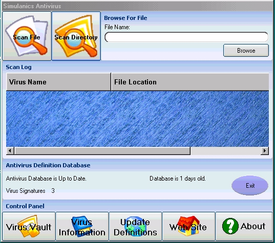



## Simulanics Antivirus v1\.00\.40

### Description

Simulanics Antivirus - 5th Update - Coming along quick in since May 28th. Some say that they can't download the source from PSC... It is also at my site on the main page...website is under construction right now...but the download link is still available! PLEASE DONT FORGET TO VOTE AT THE BOTTOM OF THE SCREEN!!! THANK YOU.

Included Are The Following:

Simulanics Antivirus -Currently Scans Files for Virus Signatures...will soon be able 			to "heal" the infected file (already underway)

SimAV Signature Creator - Pretty self explanatory. Simply load a virus (you can download huge zipped folders containing hundreds of compiled virii themselves on the internet...can't find them, then contact me. I assure you that your computer is 100% safe from downloading virii as long as you don't EXECUTE them (double click them :-)) After perusing past headers and recognizable api and functions within the virii you can find all kinds of jumbled ascii strings. (Look in signatures.db if you don't know what I'm talking about). Simply select one of them, type in the name of the virus it came from and click "Add to Database." If you don't feel safe downloading any virii then simply wait for our database to get bigger and do an automatic update from the antivirus itself...and it will download the latest version from the server. You can also experiment with the string signatures.... if you were to load a visual basic executeable created in Visual Basic 6.0 into the Signature Creator, Every Visual Basic Executable would Contain this string "MSVBVM60" (without the quotations). These methods can be used to even create a program which goes through the computer and tells you what a program is capable of doing or what it does before you even execute it...Pretty Neat huh ? :-)

Any Comments and/or suggestions and of course help is always welcome and appreciated.

Thank you for trying out Simulanics Antivirus.

-Matt Combatti

-http://www.simulanics.com

-simulanics@technologist.com
 
### More Info
 

             |
---                |---
**Submitted On**   |2005-05-29 22:49:54
**By**             |[Matthew Combatti](https://github.com/Planet-Source-Code/PSCIndex/blob/master/ByAuthor/matthew-combatti.md)
**Level**          |Advanced
**User Rating**    |4.4 (48 globes from 11 users)
**Compatibility**  |VB 4\.0 \(32\-bit\), VB 5\.0, VB 6\.0, VBA MS Access, VBA MS Excel
**Category**       |[Complete Applications](https://github.com/Planet-Source-Code/PSCIndex/blob/master/ByCategory/complete-applications__1-27.md)
**World**          |[Visual Basic](https://github.com/Planet-Source-Code/PSCIndex/blob/master/ByWorld/visual-basic.md)
**Archive File**   |[Simulanics1894585302005\.zip](https://github.com/Planet-Source-Code/matthew-combatti-simulanics-antivirus-v1-00-40__1-60763/archive/master.zip)

